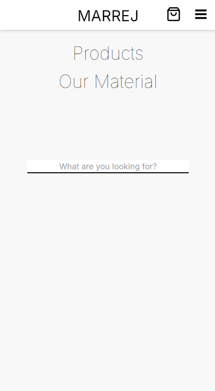

# Marrej Furniture Online Store Project

## Overview

This project is an online store for furniture built using modern web technologies. The application allows customers to search for items, add them to their cart, view their balance, adjust the quantity of items, and checkout. Upon checkout, customers receive a receipt via email. The project leverages several technologies including Next.js, React, TypeScript, Redux for state management, MongoDB for the database, Tailwind CSS for styling, and Stripe for payment processing. <u>This website uses the content of the [Dangarden store](https://dangarden.se/)</u>.

## [Online version on Vercel](https://marrej-furniture.vercel.app)

## Technologies Used

- **Next.js:** A React framework for server-side rendering, static site generation, and optimized performance.
- **React:** A JavaScript library for building user interfaces.
- **TypeScript:** A typed superset of JavaScript that adds static types.
- **Node.js:** A JavaScript runtime for building fast, scalable server-side applications.
- **Redux:** A state management library for managing application state.
- **MongoDB:** A NoSQL database for storing product and user information.
- **Tailwind CSS:** A utility-first CSS framework for quick and efficient styling.
- **Stripe:** A payment processing platform for handling transactions.
- **Nodemailer:** A library for sending emails, used here to email receipts to customers.

## Features

### Product Search
Customers can search for furniture items using a search bar. The results are fetched from the MongoDB database.

### Shopping Cart
Customers can add items to their cart, view the total balance, and adjust the quantity of each item (add, subtract, or remove from the cart).

### Checkout
At checkout, customers can enter their payment information and process their payment through Stripe. Once the payment is successful, a receipt is emailed to the customer using Nodemailer.

### State Management
Redux is used to manage the state of the shopping cart, ensuring that the cart's state is consistent across the application.

### Multi-Platform Rendering
The application is designed to render seamlessly on multiple platforms, including PCs, tablets, and phones. This is achieved through responsive design practices and Tailwind CSS, ensuring an optimal user experience across all devices.

### Database Management
MongoDB is used to store product information. Mongoose is used to define schemas and interact with the MongoDB database.

### Styling
Tailwind CSS is used for quick and efficient styling, allowing for a responsive and visually appealing user interface.

## Images
### Product carousel

### Searching for product and sorting the results by their price

### Adding a product to cart

### Checkout screen

### After successful payment

## Mobile version
### Product list

### Menu

## Conclusion

This project demonstrates how to build a comprehensive e-commerce application using a modern tech stack. By leveraging Next.js, React, TypeScript, Redux, MongoDB, Tailwind CSS, Stripe, and Nodemailer, we've created a fully functional online furniture store with efficient state management, secure payments, and responsive design.
